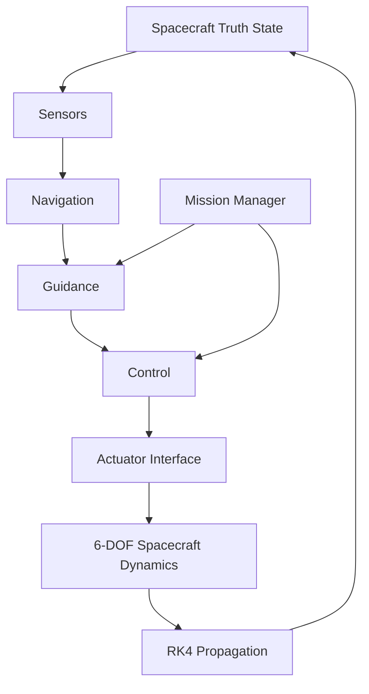

# Quadrotor GNC — 6-DOF Dynamics + Integration

A modular nonlinear quadrotor simulation with a 12-state rigid-body model, body-to-inertial thrust transformation, Euler-angle attitude kinematics, rotational rigid-body dynamics, Euler/RK4 numerical integration, and baseline open-loop maneuvers.

## Model

The state ordering is

`[x, y, z, vx, vy, vz, phi, theta, psi, p, q, r]`

and the rigid-body input is

`[T, tau_x, tau_y, tau_z]`.

Conventions used by the simulation:

- right-handed inertial frame with `+z` upward;
- gravity acts in inertial `-z`;
- positive collective thrust acts along body `+z`;
- `R_BI` maps body-frame vectors into the inertial frame;
- attitude uses a Z-Y-X yaw-pitch-roll Euler-angle convention.

The supplied mass and inertia values are nominal simulation parameters and are not presented as measurements of a specific commercial airframe.

## Project structure

```text
drone-gnc-6dof/
├── README.md
├── requirements.txt
├── src/
│   ├── parameters.py
│   ├── rotations.py
│   ├── dynamics.py
│   ├── integrators.py
│   ├── simulation.py
│   └── plotting.py
├── scripts/
│   ├── run_hover.py
│   ├── run_climb.py
│   ├── run_attitude_maneuver.py
│   └── compare_integrators.py
├── tests/
│   ├── test_hover_equilibrium.py
│   └── test_rotations.py
└── results/
    └── figures/
```

## Setup

From the repository root:

```bash
python3 -m venv .venv
source .venv/bin/activate
python -m pip install --upgrade pip
pip install -r requirements.txt
```

## Verification

```bash
pytest -v
```

The tests verify the hover equilibrium derivative and basic rotation-matrix properties.

## Run the simulations

```bash
python -m scripts.run_hover
python -m scripts.run_climb
python -m scripts.run_attitude_maneuver
python -m scripts.compare_integrators
```

Generated figures are written to `results/figures/`.

## Scenarios

### Hover

Applies `T = m g` with zero body torque. The expected equilibrium is zero translational acceleration, zero angular acceleration, and negligible numerical drift.

### Open-loop climb

Uses a smooth sinusoidal thrust perturbation about hover thrust. The first half of the maneuver accelerates upward, the second half removes the acquired vertical velocity, and the command then returns to hover thrust.

### Open-loop roll maneuver

Applies a smooth positive/negative roll-torque cycle with zero net torque impulse. This demonstrates torque-to-angular-acceleration, angular-rate, attitude, and translation/rotation coupling. It is not claimed to be closed-loop attitude tracking.

## Next engineering step

The present repository establishes and verifies the plant model. Closed-loop attitude/position control, disturbance models, state estimation, and trajectory tracking can be added after the baseline dynamics are validated.


## Spacecraft GNC Mission Scaffold

The repository now includes an initial spacecraft-oriented GNC architecture alongside the verified quadrotor rigid-body baseline.

The spacecraft extension introduces:

- a quaternion-based 13-state rigid-body representation;
- explicit inertial, body, and target frame definitions;
- target-relative translation utilities;
- sensor and actuator software interfaces;
- a mission-phase state machine for rendezvous, hover, TAG, and departure;
- free-space 6-DOF spacecraft propagation using the existing RK4 integrator;
- automated spacecraft propagation and mission-logic tests.

### GNC Architecture



### Mission Sequence


### Current Capability

The project currently provides a verified nonlinear rigid-body simulation foundation and an initial spacecraft mission architecture. The spacecraft scaffold supports quaternion attitude representation, body/inertial frame transformation, free-space translational and rotational propagation, body-wrench commands, target-relative state definitions, mission-phase management, and automated smoke tests.

The current spacecraft model is intentionally a free-space rigid-body propagator. It does not yet claim orbital rendezvous, autonomous navigation, closed-loop TAG guidance, or flight-qualified actuator modeling.

### Next Capability

The next development milestone is to close the first spacecraft GNC loop:

1. add target-relative orbital/environment dynamics;
2. generate simulated rendezvous sensor measurements;
3. introduce a navigation state estimate distinct from truth;
4. implement rendezvous and hover guidance;
5. implement translational and attitude feedback control;
6. map commanded body wrench to spacecraft actuators;
7. execute rendezvous -> hover -> TAG -> departure in closed loop.

