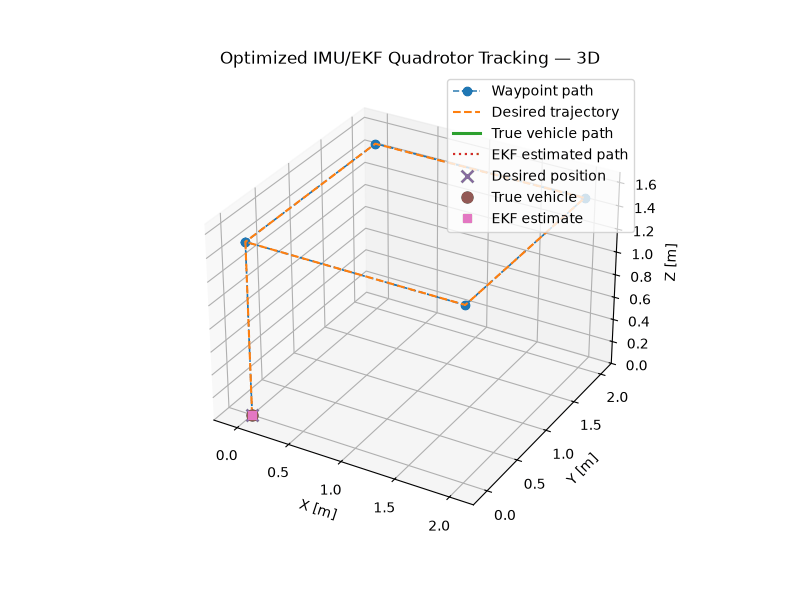
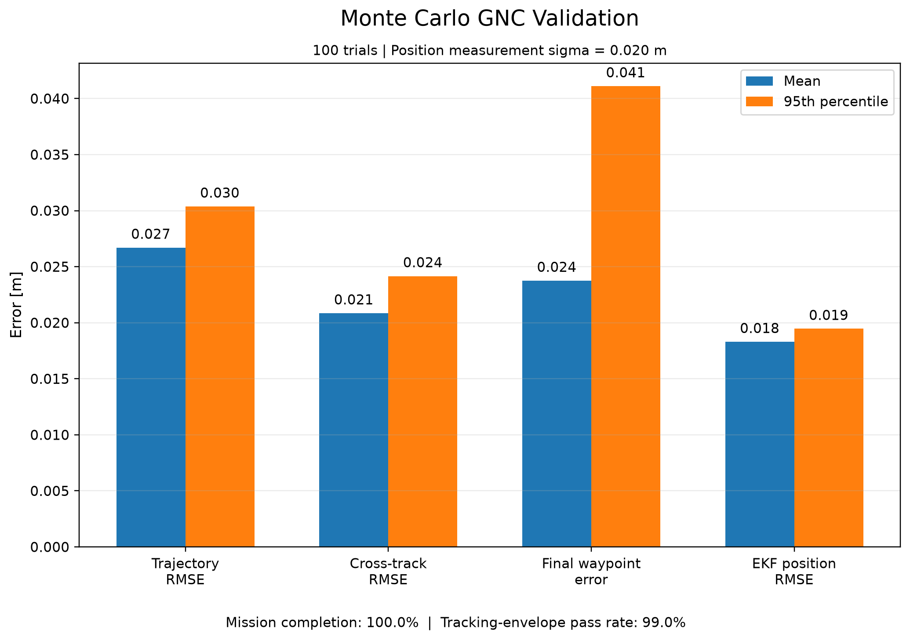

# Flight Guidance, Navigation & Control Simulation

Python simulation environment for developing and evaluating guidance, navigation, and control algorithms using nonlinear 6-DOF vehicle dynamics.

Current vehicle: **Quadrotor**

## Closed-Loop Flight



## Performance

| Metric | Nominal | Monte Carlo P95 |
|---|---:|---:|
| Trajectory RMSE | **0.0223 m** | **0.0304 m** |
| Cross-track RMSE | **0.0180 m** | **0.0242 m** |
| Final waypoint error | **0.0263 m** | **0.0411 m** |
| EKF position RMSE | **0.0176 m** | **0.0195 m** |

**Mission completion:** 100 / 100 trials  
**Tracking-envelope pass rate:** 99 / 100 trials



## Capabilities

- Nonlinear 6-DOF vehicle dynamics
- Waypoint guidance
- Cascaded position, attitude, and angular-rate control
- IMU and position sensor simulation
- 15-state error-state Extended Kalman Filter
- Controller gain optimization
- Monte Carlo validation

## Architecture

```text
Guidance
   ↓
Navigation / State Estimation
   ↓
Flight Control
   ↓
Vehicle Model
   ↓
6-DOF Dynamics