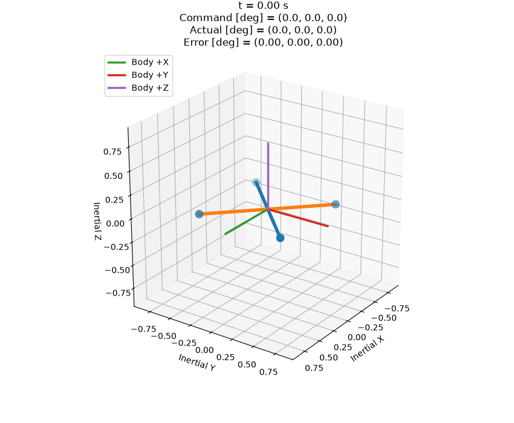

## Closed-Loop Quadrotor Attitude Control

The verified nonlinear plant now includes a cascaded roll/pitch/yaw attitude
controller. An outer attitude loop generates desired body rates, and an inner
PID loop regulates \(p,q,r\) with commanded body torques.

Run:

```bash
python -m scripts.run_closed_loop_attitude
```

The experiment automatically generates tracking plots, torque histories, a CSV
time series, and a GitHub-ready 3-D animation.



See
[`docs/CLOSED_LOOP_ATTITUDE_CONTROL.md`](docs/CLOSED_LOOP_ATTITUDE_CONTROL.md)
for controller architecture and implementation details.
