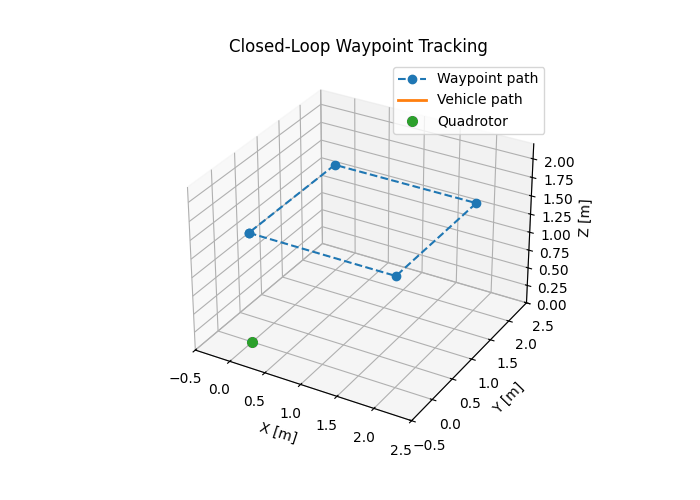
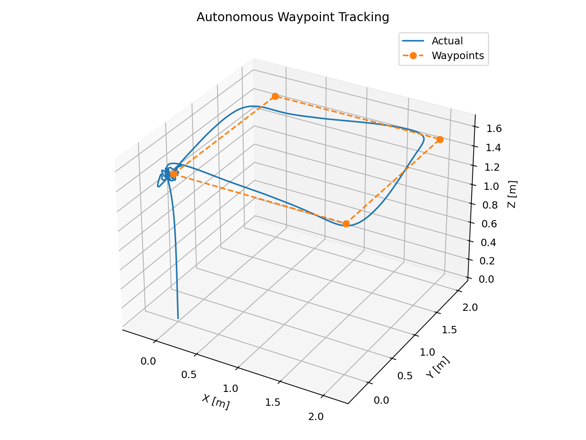
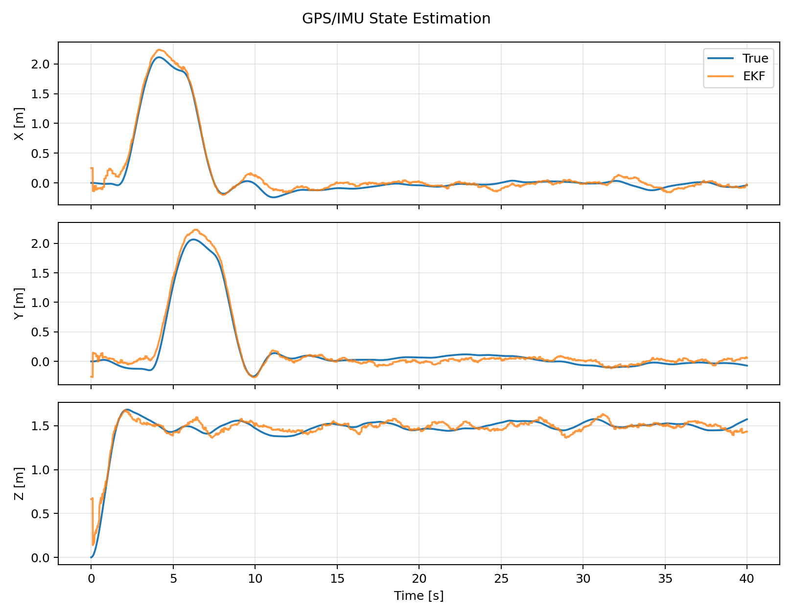

# Vehicle GNC Simulation Framework

**Modular guidance, navigation, and control simulation framework with a nonlinear 6-DOF quadrotor reference vehicle.**

This repository is structured as a reusable GNC software project rather than a single-vehicle demo. The current reference implementation is a quadrotor, while the `VehicleModel` interface is intentionally general so future fixed-wing, VTOL, spacecraft, ground-vehicle, or manipulator dynamics can be added without rewriting the guidance, estimation, evaluation, and simulation layers.

## Demo — Closed-Loop Waypoint Mission



The animation is intentionally placed first so a reviewer can see the system doing useful closed-loop work before reading implementation details.

## Verified Results

Results below are generated by `scripts/run_waypoint_demo.py` from the code in this repository.

| Metric | Result |
|---|---:|
| Waypoints reached | **5 / 5** |
| Final waypoint error | **0.109 m** |
| Path cross-track RMSE | **0.217 m** |
| EKF position RMSE | **0.126 m** |
| Controller update rate | **100 Hz** |
| GPS update rate | **10 Hz** |
| Torque saturation | **0.100% of samples** |
| Automated tests | **5 passed** |

A separate randomized robustness run (`scripts/run_monte_carlo.py`) perturbs vehicle mass and inertia. The included 30-case verification run achieved **100% mission completion**, with a median waypoint-reference RMSE of **0.658 m**. These values are reproducible outputs, not manually entered targets.

## System Architecture

```text
Mission / Waypoints
       |
       v
+---------------+
|   Guidance    |
+-------+-------+
        |
        v
Position / Velocity References
        |
        v
+-------------------+
| Position Control  |
+---------+---------+
          |
          v
Desired Attitude + Collective Thrust
          |
          v
+-------------------+
| Attitude / Rate   |
|      Control      |
+---------+---------+
          |
          v
Body Torques + Thrust
          |
          v
+-------------------+
|   Vehicle Model   |  <-- replaceable dynamics interface
+---------+---------+
          |
          v
       True State
       /       \
      v         v
    IMU         GPS
      \         /
       v       v
 +-----------------+
 | 15-State ESKF   |
 +--------+--------+
          |
          v
   Estimated State
          |
          +---------------> Feedback
```

## Core Capabilities

| Area | Current Implementation |
|---|---|
| Vehicle dynamics | Nonlinear 12-state / 6-DOF Newton-Euler quadrotor |
| Vehicle abstraction | General `VehicleModel` interface for future dynamics models |
| Numerical integration | Classical fourth-order Runge-Kutta |
| Guidance | Sequential 3-D waypoint guidance |
| Position control | Outer-loop position/velocity feedback |
| Attitude control | Cascaded attitude and body-rate control |
| Sensors | Accelerometer, gyroscope, GPS position, GPS velocity |
| Navigation | 15-state error-state EKF structure |
| Robustness | Randomized mass/inertia Monte Carlo evaluation |
| Verification | pytest regression tests and reproducible result files |
| Visualization | 3-D waypoint GIF, trajectory plot, EKF position plot |

## Vehicle Layer

The current vehicle is a quadrotor, but the repository is intentionally **vehicle-general**.

```text
src/drone_gnc/vehicles/
|
|-- base.py          # VehicleModel contract
`-- quadrotor.py     # Current 6-DOF reference vehicle
```

Every future vehicle implements the same core contract:

```python
class VehicleModel:
    def derivatives(self, state, control):
        ...

    def nominal_control(self):
        ...
```

This separates the question **"How does this vehicle move?"** from the questions **"Where should it go?"**, **"What does the estimator believe?"**, and **"How should performance be measured?"**

### Current reference vehicle: quadrotor

The quadrotor state is

$$
\mathbf{x}=
\begin{bmatrix}
\mathbf{p}^{T} &
\mathbf{v}^{T} &
\boldsymbol{\eta}^{T} &
\boldsymbol{\omega}^{T}
\end{bmatrix}^{T}
\in\mathbb{R}^{12}.
$$

The control input is

$$
\mathbf{u}=
\begin{bmatrix}
T & \tau_x & \tau_y & \tau_z
\end{bmatrix}^{T}.
$$

The vehicle dynamics are propagated through

$$
\dot{\mathbf{x}}=f(\mathbf{x},\mathbf{u}).
$$

Detailed derivations are kept in `docs/dynamics.md` so the front page remains recruiter-readable.

## Navigation

The navigation layer uses a 15-state error-state structure

$$
\delta\mathbf{x}=
\begin{bmatrix}
\delta\mathbf{p}^{T} &
\delta\mathbf{v}^{T} &
\delta\boldsymbol{\theta}^{T} &
\delta\mathbf{b}_{a}^{T} &
\delta\mathbf{b}_{g}^{T}
\end{bmatrix}^{T}.
$$

The GPS measurement update uses the standard Kalman structure

$$
\mathbf{K}_{k}
=
\mathbf{P}_{k}^{-}\mathbf{H}_{k}^{T}
\left(
\mathbf{H}_{k}\mathbf{P}_{k}^{-}\mathbf{H}_{k}^{T}
+
\mathbf{R}_{k}
\right)^{-1}.
$$

The current implementation demonstrates IMU-driven propagation and GPS position/velocity correction while maintaining covariance and bias states. See `docs/estimation.md` for assumptions and limitations.

## Results

### 3-D Waypoint Tracking



### GPS / IMU State Estimation



Raw metrics and logs are stored under `results/data/` so every headline number can be traced back to generated data.

## Repository Structure

```text
drone-gnc-6dof/
|
|-- src/drone_gnc/
|   |-- vehicles/          # Replaceable vehicle dynamics models
|   |-- control/           # Flight-control algorithms
|   |-- estimation/        # Sensor models and state estimation
|   |-- guidance/          # Mission and reference generation
|   |-- disturbances/      # Environmental disturbances
|   |-- simulation/        # Integration and closed-loop execution
|   `-- evaluation/        # Metrics and verification utilities
|
|-- scripts/               # Reproducible engineering experiments
|-- tests/                 # Automated verification
|-- results/
|   |-- animations/
|   |-- guidance/
|   |-- estimation/
|   |-- robustness/
|   `-- data/
|-- docs/                  # Technical derivations and design notes
|-- requirements.txt
|-- pyproject.toml
`-- README.md
```

## Quick Start

```bash
git clone https://github.com/swmezon/drone-gnc-6dof.git
cd drone-gnc-6dof
python -m venv .venv
```

Windows:

```bash
.venv\Scripts\activate
```

Install dependencies:

```bash
pip install -r requirements.txt
```

Run verification:

```bash
pytest -q
```

Generate the waypoint mission, figures, metrics, and animation:

```bash
python scripts/run_waypoint_demo.py
```

Run the robustness study:

```bash
python scripts/run_monte_carlo.py
```

## Verification Philosophy

The repository separates **claims** from **evidence**. A performance number belongs in the README only when a script generates it and a reviewer can reproduce it.

Current automated checks cover:

- rotation-matrix orthonormality,
- hover equilibrium,
- bounded controller output,
- waypoint progression,
- EKF covariance symmetry.

## Development Roadmap

| Capability | Status |
|---|---|
| General vehicle-model interface | ✅ Implemented |
| Nonlinear 6-DOF quadrotor | ✅ Implemented |
| Cascaded position / attitude / rate control | ✅ Implemented |
| IMU + GPS models | ✅ Implemented |
| 15-state error-state EKF structure | ✅ Implemented |
| 3-D waypoint mission | ✅ Implemented |
| Recruiter-facing mission animation | ✅ Implemented |
| Automated verification | ✅ Implemented |
| Monte Carlo parameter variation | ✅ Implemented |
| Wind-gust benchmark | Planned |
| LQR benchmark | Planned |
| Trajectory generator beyond discrete waypoints | Planned |
| ROS 2 / PX4 SITL integration | Future extension |
| Additional vehicle dynamics | Future extension |

## Engineering Scope

The project is intended to demonstrate the complete engineering chain:

```text
Dynamics -> Guidance -> Control -> Sensors -> Estimation
         -> Closed-Loop Simulation -> Metrics -> Robustness
```

The architecture is deliberately modular so future vehicle dynamics can be added without turning the repository into separate nested projects.

## License

MIT License.
