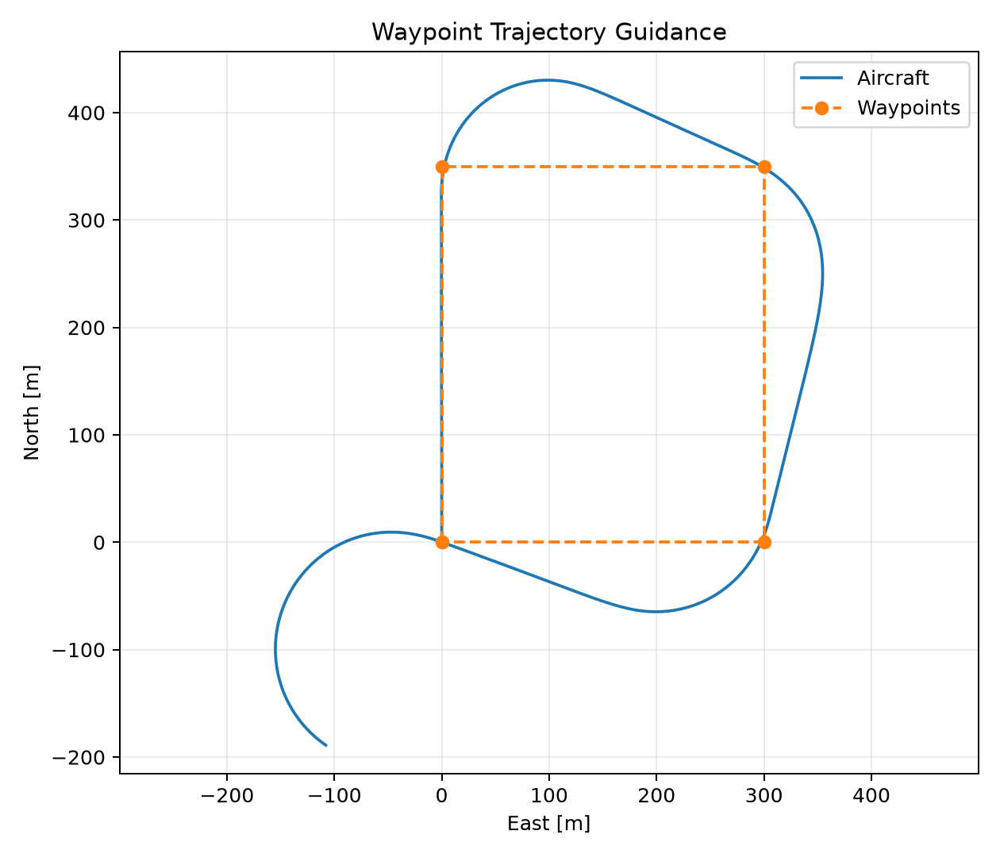
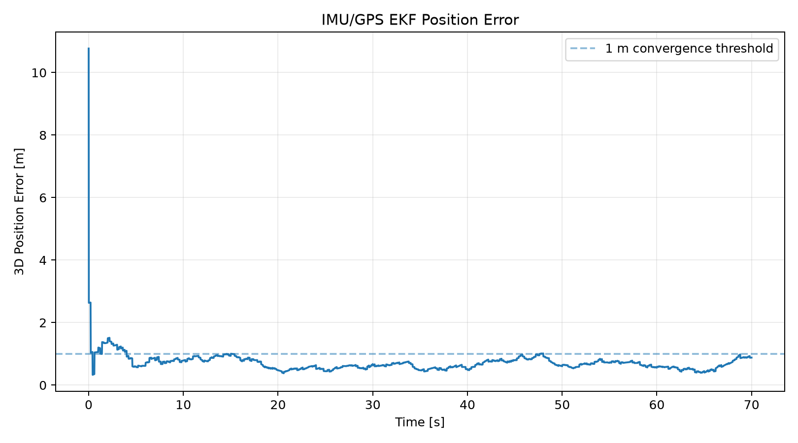
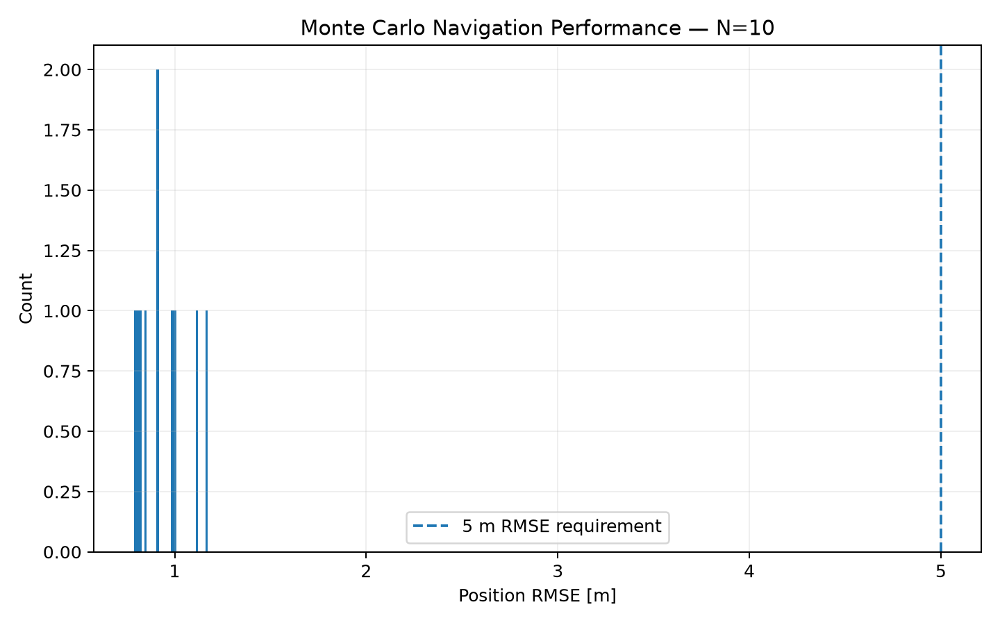

# Fixed-Wing UAV GNC Proof of Concept

A reproducible Python portfolio project for nonlinear fixed-wing guidance, navigation, and control (GNC): 6-DOF rigid-body dynamics, trim, numerical linearization, cascaded attitude/rate control, waypoint guidance, simulated IMU/GPS sensors, a 15-state EKF, local SISO stability margins, actuator limits, and Monte Carlo verification.

## Run

```bash
python -m pip install -r requirements.txt
python -m pytest -q
python -m scripts.run_all --mc-cases 50
```

Use the 50-case command as a quick development check. For the résumé-quality run:

```bash
python -m scripts.run_all --mc-cases 500 --jobs 8
```

On a computer where multiprocessing causes trouble, use `--jobs 1`; it is slower but easier to debug.

Generated résumé metrics are written to `results/data/resume_metrics.json`. **Do not hand-edit résumé numbers.**

## Current verified development-run results

The current code has been smoke-tested with a 50-case dispersed Monte Carlo run. Final résumé numbers should be regenerated on your machine using the 500-case command above.

| Metric | Current development result |
|---|---:|
| EKF state dimension | 15 |
| Nominal 3D position RMSE | **0.76 m** |
| Nominal position convergence | **4.02 s** |
| Minimum local gain margin | **20.5 dB** |
| Minimum local phase margin | **81.4°** |
| Roll/pitch gain-crossover range | **3.94–4.77 rad/s** |
| Development Monte Carlo cases | **50** |
| Development pass rate | **92%** |

## Verification requirements

A Monte Carlo case passes when all of the following are true:

- 3D position RMSE < 5 m
- EKF position convergence < 8 s
- control-surface saturation fraction < 10%
- truth and estimator states remain numerically finite

## Monte Carlo dispersions

Each case varies:

- IMU/GPS sensor noise and fixed bias draws
- steady NED wind (2 m/s horizontal 1-sigma, 0.5 m/s vertical 1-sigma)
- aircraft mass and principal inertias
- selected longitudinal and lateral-directional aerodynamic derivatives

Aircraft/model parameters use 5% 1-sigma Gaussian multiplicative dispersion, clipped to ±15%.

## Stability-analysis wording

Gain and phase margins are computed from **local linear SISO roll-rate and pitch-rate loops about straight-and-level trim**, including representative first-order actuator and sensor lag. Actuator magnitude/rate saturation is checked separately in the nonlinear simulation. Do not describe the linear margins as being computed “under saturation.”

## Evidence







## Architecture

```text
Waypoints -> Guidance -> Cascaded Autopilot -> 6-DOF Plant
                                      ^             |
                                      |             v
                                  EKF State <- IMU + GPS
```

## Résumé template

After the final 500-case run, fill the brackets only from `results/data/resume_metrics.json`:

> **6-DOF Fixed-Wing UAV GNC Simulation — Python**  
> • Developed nonlinear 6-DOF flight dynamics with cascaded attitude/rate autopilot and waypoint trajectory guidance.  
> • Implemented a **15-state EKF** fusing simulated IMU/GPS measurements for position, velocity, attitude, and sensor-bias estimation; achieved **[position RMSE] m** nominal 3D position RMSE with **[convergence] s** convergence.  
> • Linearized about straight-and-level trim; local roll/pitch rate loops achieved **≥[GM] dB gain margin / ≥[PM]° phase margin** at **[crossover range] rad/s** gain crossover; actuator magnitude/rate limits were verified separately in nonlinear simulation.  
> • Ran a **[N]-case Monte Carlo** over sensor noise/bias, wind, mass/inertia, and aerodynamic-coefficient uncertainty; **[Z]%** met requirements of **<5 m position RMSE, <8 s EKF convergence, <10% surface saturation, and no numerical divergence**.

## Study guide

Read [`docs/INTERVIEW_TUTORIAL.md`](docs/INTERVIEW_TUTORIAL.md) while stepping through the code. It explains the equations, the physical meaning, the implementation, and the interview questions each block is meant to answer.
